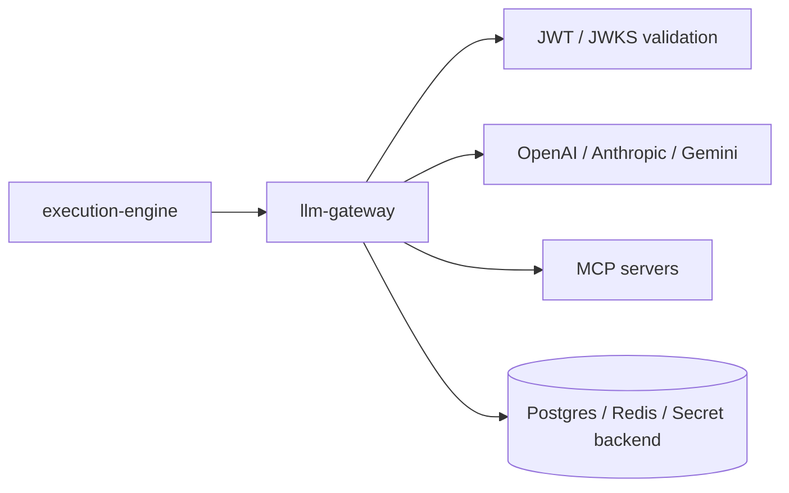
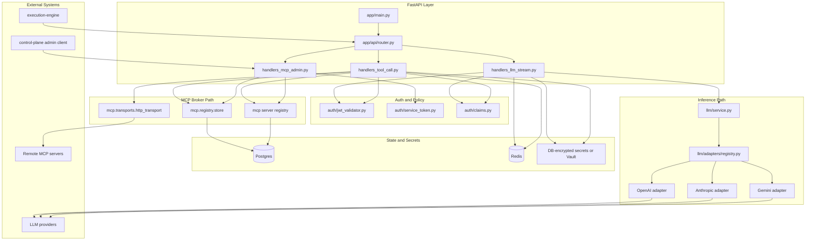

# LLM Gateway Architecture

The LLM gateway is the credential and policy boundary for:

1. multi-provider LLM inference
2. NDJSON streaming responses to execution-engine
3. MCP tool brokering
4. tenant- and run-scoped authorization
5. tool registry and secret-backed remote MCP configuration

## High-Level Diagram

## Detailed Diagram

## Primary Responsibilities

1. validate run-scoped JWTs and enforce request scope
2. normalize execution-engine requests into provider-specific calls
3. stream provider output as normalized NDJSON events
4. broker MCP tool calls with registry lookups, schema validation, and secret-backed auth
5. expose internal admin APIs for cluster MCP server and tool management
